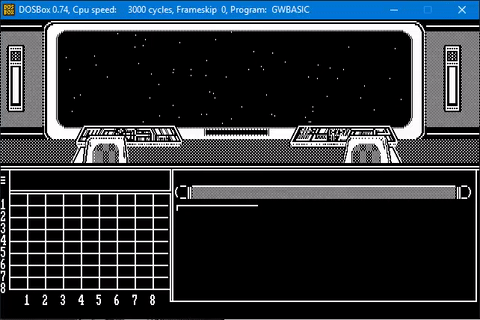
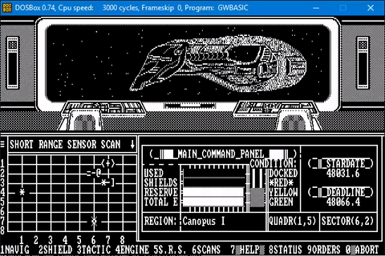
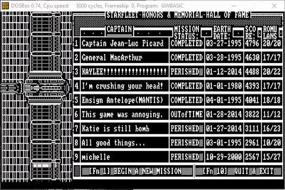
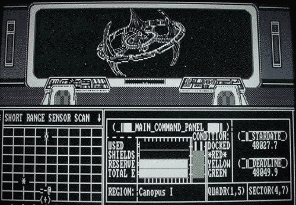

# StarTrek_BASIC
GW-BASIC ASCII Star Trek game based on code from Creative Computing









## Background
When I was 15 in 1993 through 1995 I took a Star Trek BASIC game in an old programming book I found at a thrift store and wrote an etch-a-sketch program to add graphics and an ASCII GUI front-end. I plan to port this to JavaScript for fun later when I have some free time (and have read up on a few more JS and graphics programming books).

NOTE: I taught myself to program on this game (very poorly). The code is spaghetti-code. (Hey, it's BASIC! Whaddaya expect! ;-) Also, I am not the original author of the original concept. See videos below for explanation. However, the graphics and heavy modifications are all my own. All Star Trek characters are trademarks of their respective owners (Paramount), etcetera.

## Related Videos
* [Game Intro and Game Play](https://www.youtube.com/watch?v=ylMEzmm_QPY) (5:20)
* [Game Credits and Screenshots](https://www.youtube.com/watch?v=MVHS624f544) (2:49)

## Install
1. Install DOS Box to your computer.
* [DOS Box](http://www.dosbox.com/)

2. Copy the Star Trek program to a folder on your computer (e.g. C:\DOS\st_basic)

3. Launch DOS Box. (Note: press ALT+ENTER to toggle between full-screen mode or windowed mode on a PC.)

4. Run mount command to mount your DOS folder:
Z:\> mount c c:\dos

5. Change directory to star trek game:
```
c:
dir
cd st_basic
```

6. Launch the game:
```
startrek.bat
```

7. NOTE: The numbered keys at the bottom of the screen correspond to your keyboard's F1 - F12 function keys. Some laptops require the use of a "Fn" key in conjunction with the numbered keys on the keyboard. YMMV.

8. Have fun.


