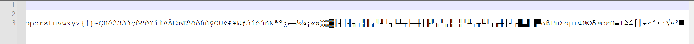
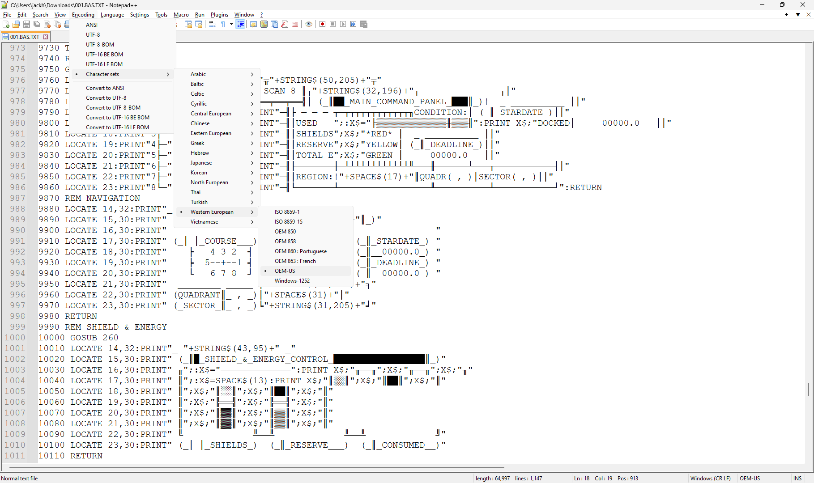

# Source Code

As mentioned earlier, the true original source code is in [David
H. Ahl's Basic Computer Games Microcomputer
Edition](https://archive.org/details/basic-computer-games-microcomputer-edition_202207).

My modified game source code in this directory is an export from the
BASIC ".BAS" files.

## Viewing the Extended ASCII text files

- Install Notepad++ which supports encodings that can read Extended ASCII characters
- Open the text file with Notepad++.
- Change your encoding:
Encoding | Character sets | Western European | OEM-US
- You can verify using test file 256.txt
  - Test file courtesy of [Dernyn's 256 Font project](https://github.com/dernyn/256)

## Examples

### 256.txt:


### 001.txt:



## Exporting from the BAS files

If you want to export the source code directly from the BAS files:

- Clone the Star Trek repo:
```git clone <star-trek-repo-url>```

- Copy/move the st_basic folder to, for example, c:\st_basic:
```move st_basic c:\```

- Launch DOSBox.

- Mount your DOSBox 'c' drive:
```mount c c:\st_basic```

- Change to the mounted 'c' drive:
```c:```

- Launch GWBASIC:
```gwbasic.exe```

- In GWBASIC, load a BAS file:
```load "startrek.bas"

- (Optional) Feel free to list the content:
```list```

- Save in ASCII format using an 8.3 filename format:
```save "startrek.txt",a```

- Repeat the load and save steps for as many BAS files as your heart desires.

- When all done, exit GWBASIC back to DOSBox:
```system```

- Exit DOSBox:
```exit```

NOTE: Really, these notes were for my recollection of how I exported these.
